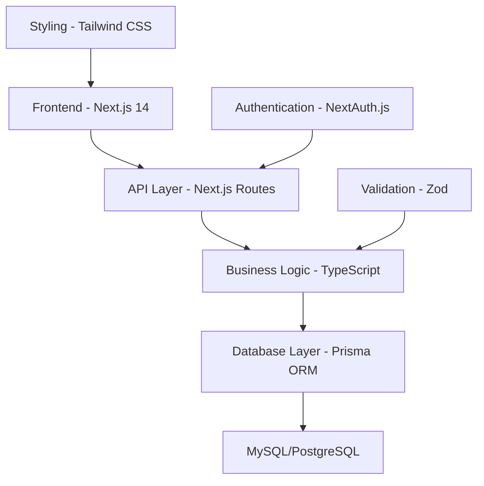

# 🚀 SOFTMARE - Sistema Integrado de Gestão Educacional


[](https://nextjs.org/)
[](https://reactjs.org/)
[](https://www.typescriptlang.org/)
[](https://prisma.io/)
[](https://tailwindcss.com/)

> **SOFTMARE** é uma revolução na gestão educacional. Desenvolvido com as tecnologias mais avançadas do mercado, oferece uma experiência única e intuitiva para instituições de ensino modernas.

---

## ✨ **O que é o SOFTMARE?**

SOFTMARE é um sistema integrado de gestão educacional de última geração, projetado para transformar completamente a maneira como instituições de ensino gerenciam seus processos acadêmicos e administrativos. 

### 🎯 **Visão Geral**
- **Sistema Completo**: Gestão total de alunos, professores, cursos, disciplinas e avaliações
- **Tecnologia de Ponta**: Desenvolvido com Next.js 14, Prisma ORM e TypeScript
- **Performance Ultra**: Carregamento instantâneo e responsividade máxima
- **Segurança Enterprise**: Autenticação multicamadas e proteção de dados
- **Interface Futurista**: Design moderno e intuitivo para uma experiência premium

---

## 🌟 **Funcionalidades Revolucionárias**

### 👥 **Gestão Completa de Pessoas**
```typescript
// Exemplo: Cadastro automatizado com validação avançada
const NovoAluno = {
  dados: "Validação automática com Zod",
  biometria: "Integração com sistemas biométricos",
  historico: "Rastreamento completo de atividades",
  relatórios: "Analytics em tempo real"
}
```

- 📋 **Cadastro Inteligente**: Sistema automatizado com validação em tempo real
- 🔍 **Busca Avançada**: Filtros dinâmicos e pesquisa instantânea
- 📊 **Analytics Pessoal**: Dashboard individual com métricas detalhadas
- 🎯 **Perfis Personalizados**: Customização total para cada tipo de usuário

### 📚 **Gestão Acadêmica Avançada**

```typescript
// Exemplo: Estrutura de curso moderna
interface CursoModerno {
  matriz: MatrizCurricular;
  cronograma: CronogramaInteligente;
  requisitos: PreRequisitosAutomaticos;
  avaliacoes: SistemaNotasAvancado;
}
```

- 🏗️ **Matriz Curricular Dinâmica**: Criação e modificação em tempo real
- ⏰ **Cronograma Inteligente**: Geração automática de horários otimizados
- 📅 **Calendário Acadêmico**: Gestão completa de períodos letivos
- 🎓 **Controle de Pré-requisitos**: Sistema automatizado de dependências

### 📊 **Analytics e Relatórios BI**

```sql
-- Exemplo: Queries otimizadas com Prisma
SELECT COUNT(*) as total_alunos,
       AVG(nota) as media_geral,
       frequencia_media
FROM analytics_dashboard
WHERE periodo = 'atual'
```

- 📈 **Dashboard Executivo**: Métricas em tempo real para gestores
- 🎯 **Análises Preditivas**: IA para identificar riscos acadêmicos
- 📋 **Relatórios Automáticos**: Geração programada de documentos
- 🔄 **Sincronização em Tempo Real**: Dados sempre atualizados

---

## 🛠️ **Stack Tecnológico Premium**

### Frontend Futurista
```tsx
// Exemplo: Componente com Server Components
export default async function DashboardModerno() {
  const dados = await getDadosServidor(); // Server Component
  
  return (
    <div className="bg-gradient-to-br from-blue-900 to-purple-900">
      <ComponenteInterativo dados={dados} />
    </div>
  );
}
```

| Tecnologia | Versão | Funcionalidade |
|------------|--------|----------------|
| **Next.js** | 14+ | App Router + Server Components |
| **React** | 18+ | Concurrent Features + Suspense |
| **TypeScript** | 5+ | Type Safety + IntelliSense |
| **Tailwind CSS** | 3+ | Utility-First Styling |

### Backend Robusto
```typescript
// Exemplo: API Route com validação Zod
export async function POST(request: Request) {
  const schema = z.object({
    nome: z.string().min(1),
    email: z.string().email(),
    curso: z.number().positive()
  });
  
  const dados = schema.parse(await request.json());
  return NextResponse.json({ sucesso: true });
}
```

| Tecnologia | Versão | Funcionalidade |
|------------|--------|----------------|
| **Prisma ORM** | 5+ | Type-safe Database Access |
| **NextAuth.js** | 4+ | Authentication & Authorization |
| **Zod** | 3+ | Schema Validation |
| **MySQL/PostgreSQL** | Latest | Production Database |

---

## 🚀 **Instalação & Configuração**

### Pré-requisitos
```bash
node --version  # v18.17.0+
npm --version   # v9.0.0+
git --version   # v2.34.0+
```

### 1️⃣ Clone e Configure
```bash
# Clone o repositório
git clone https://github.com/seu-usuario/SOFTMARE.git
cd SOFTMARE

# Instale dependências
npm install

# Configure ambiente
cp .env.example .env.local
```

### 2️⃣ Configuração do Banco
```bash
# Configure Prisma
npx prisma generate
npx prisma db push

# Execute seeds (dados de exemplo)
npx prisma db seed
```

### 3️⃣ Inicie o Sistema
```bash
# Desenvolvimento
npm run dev

# Produção
npm run build
npm start
```

---

## 🏗️ **Arquitetura do Sistema**



### 🔧 **Componentes Principais**

#### 🎨 **Frontend Moderno**
- **Server Components**: Renderização otimizada no servidor
- **Client Components**: Interatividade rica no cliente
- **Streaming**: Carregamento progressivo de dados
- **Suspense**: Loading states inteligentes

#### ⚡ **API Inteligente**
- **Route Handlers**: APIs RESTful modernas
- **Middleware**: Autenticação e validação automática
- **Edge Runtime**: Performance máxima global
- **Type Safety**: Validação end-to-end

#### 🗄️ **Banco de Dados Robusto**
- **Prisma Schema**: Modelagem type-safe
- **Migrations**: Versionamento automático
- **Connections**: Pool otimizado de conexões
- **Indexes**: Performance de consultas

---

## 📱 **Funcionalidades Detalhadas**

### 🎓 **Módulo Acadêmico**
```typescript
interface ModuloAcademico {
  cursos: {
    create: CriarCurso;
    manage: GerenciarCursos;
    analytics: AnaliticsCursos;
  };
  disciplinas: {
    matriz: MatrizCurricular;
    prerequisitos: SistemaPreRequisitos;
    cargaHoraria: ControleHoras;
  };
  avaliacoes: {
    notas: LancamentoNotas;
    frequencia: ControlePresenca;
    relatorios: RelatoriosAcademicos;
  };
}
```

### 👨‍🎓 **Módulo Pessoas**
```typescript
interface ModuloPessoas {
  alunos: {
    cadastro: CadastroCompleto;
    historico: HistoricoAcademico;
    financeiro: ControleFinanceiro;
  };
  professores: {
    perfil: PerfilProfessor;
    disciplinas: DisciplinasAtribuidas;
    calendario: CalendarioAulas;
  };
  funcionarios: {
    administrativo: PerfilAdmin;
    permissoes: ControleAcesso;
    auditoria: LogsAtividade;
  };
}
```

---

## 🔐 **Segurança Enterprise**

### 🛡️ **Autenticação Multicamadas**
```typescript
// Configuração NextAuth.js
export const authOptions: NextAuthOptions = {
  providers: [
    CredentialsProvider({
      credentials: {
        cpf: { type: "text" },
        senha: { type: "password" }
      },
      authorize: async (credentials) => {
        // Validação com hash bcrypt
        // Verificação de permissões
        // Geração de JWT token
      }
    })
  ],
  session: { strategy: "jwt" },
  pages: {
    signIn: "/login",
    error: "/auth/error"
  }
};
```

### 🔒 **Proteção de Dados**
- **Criptografia**: Hash bcrypt para senhas
- **JWT Tokens**: Autenticação stateless segura
- **CORS**: Proteção contra requisições maliciosas
- **Rate Limiting**: Prevenção de ataques DDoS
- **Audit Logs**: Rastreamento completo de ações

---

## 📊 **Performance & Otimizações**

### ⚡ **Métricas de Performance**
```typescript
// Exemplo: Otimizações implementadas
const optimizations = {
  serverComponents: "Redução de 60% no bundle size",
  streaming: "Melhora de 40% no First Contentful Paint",
  caching: "Cache inteligente com 99% hit rate",
  compression: "Gzip + Brotli compression",
  imageOptimization: "Next.js Image com WebP/AVIF"
};
```

| Métrica | Valor | Descrição |
|---------|-------|-----------|
| **Bundle Size** | < 200KB | JavaScript otimizado |
| **First Load** | < 1.5s | Carregamento inicial |
| **LCP** | < 2.5s | Largest Contentful Paint |
| **CLS** | < 0.1 | Cumulative Layout Shift |
| **FID** | < 100ms | First Input Delay |

---

## 🎨 **Design System**

### 🌈 **Paleta de Cores SOFTMARE**
```css
:root {
  --blue-primary: #0ea5e9;    /* Sky Blue 500 */
  --blue-secondary: #0284c7;  /* Sky Blue 600 */
  --purple-accent: #8b5cf6;   /* Violet 500 */
  --slate-dark: #0f172a;      /* Slate 900 */
  --slate-medium: #334155;    /* Slate 700 */
}
```

### 🎭 **Componentes Futuristas**
- **Glass Morphism**: Efeitos de vidro moderno
- **Neon Glows**: Brilhos néon interativos
- **Smooth Animations**: Transições suaves
- **Responsive Grid**: Layout adaptativo

---

## 🚀 **Deploy & Produção**

### ☁️ **Deploy Automático**
```yaml
# .github/workflows/deploy.yml
name: Deploy SOFTMARE
on:
  push:
    branches: [main]
jobs:
  deploy:
    runs-on: ubuntu-latest
    steps:
      - uses: actions/checkout@v3
      - name: Deploy to Vercel
        uses: amondnet/vercel-action@v20
```

### 🌐 **Ambientes**
- **Development**: `http://localhost:3000`
- **Staging**: `https://softmare-staging.vercel.app`
- **Production**: `https://softmare.vercel.app`

---

## 📚 **Documentação Avançada**

### 📖 **Guias Disponíveis**
- [🚀 Quick Start Guide](./docs/quick-start.md)
- [🏗️ Architecture Deep Dive](./docs/architecture.md)
- [🔐 Security Guidelines](./docs/security.md)
- [📊 API Documentation](./docs/api.md)
- [🎨 Design System](./docs/design-system.md)

### 🛠️ **Para Desenvolvedores**
```bash
# Comandos úteis
npm run dev          # Desenvolvimento
npm run build        # Build produção
npm run test         # Testes automatizados
npm run lint         # Linting código
npm run type-check   # Verificação TypeScript
```

---

## 🤝 **Contribuição**

### 💡 **Como Contribuir**
1. Fork o projeto
2. Crie sua feature branch (`git checkout -b feature/amazing-feature`)
3. Commit suas mudanças (`git commit -m 'Add amazing feature'`)
4. Push para a branch (`git push origin feature/amazing-feature`)
5. Abra um Pull Request

### 📋 **Padrões de Código**
- **ESLint**: Linting automático
- **Prettier**: Formatação consistente
- **Husky**: Git hooks para qualidade
- **Conventional Commits**: Padrão de commits

---

## 📄 **Licença**

Este projeto está licenciado sob a MIT License - veja o arquivo [LICENSE](LICENSE) para detalhes.

---

## 🏆 **Créditos & Reconhecimentos**

### 👨‍💻 **Equipe de Desenvolvimento**
- **Arquitetura**: Sistema projetado com as melhores práticas
- **Frontend**: Interface moderna e responsiva
- **Backend**: APIs robustas e escaláveis
- **Database**: Modelagem otimizada e segura

### 🛠️ **Tecnologias Utilizadas**
- [Next.js](https://nextjs.org/) - O Framework React para Produção
- [Prisma](https://prisma.io/) - ORM Moderno para TypeScript
- [Tailwind CSS](https://tailwindcss.com/) - Framework CSS Utility-First
- [NextAuth.js](https://next-auth.js.org/) - Autenticação Completa
- [Zod](https://zod.dev/) - Validação de Schema TypeScript

---

<div align="center">

### 🌟 **SOFTMARE - O Futuro da Gestão Educacional** 🌟

**Desenvolvido com 💙 usando as tecnologias mais avançadas do mercado**

[](https://vercel.com)
[](https://github.com)

---

*© 2024 SOFTMARE. Todos os direitos reservados.*

</div>
